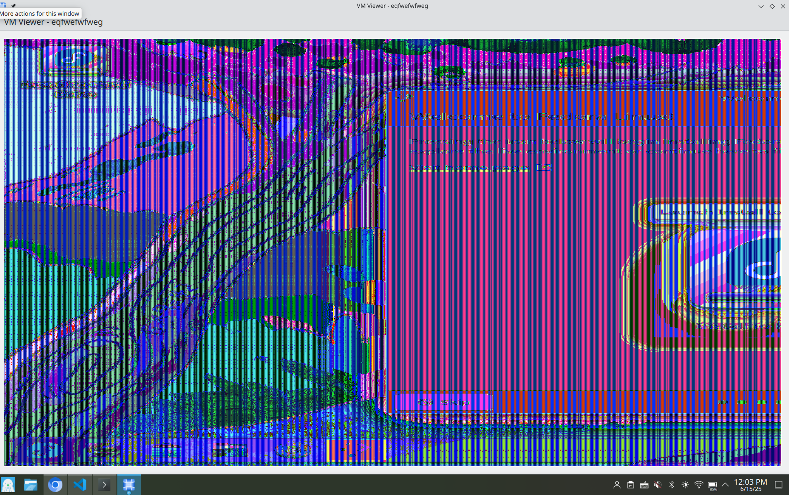
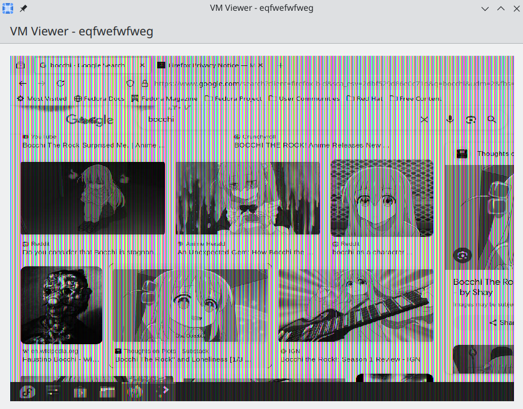

WIP

After my initial status blog, I was really surprised to see so much support and excitement about Karton, and I'm grateful for it!

A few weeks have gone by since the official coding period for Google Summer of Code began. I wanted to share what I've been working on with the project!

## VM Installer

Earlier this month, I was finishing up addressing feedback (thanks again to Harald!) on the VM installer-related MR. I had made some improvements to memory management, bug fixes related to detecting ISO disks, as well as refactoring of the class structures. I also ported it over to using QML modules, which is much more commonly used in KDE apps, instead of exposing objects at runtime.

After a bit more review, this has now been merged into the master branch! This was what was featured in the previous demo video and you can find a list of the full changes on the commit.

## SPICE Client

Two weeks ago, I started to get back to work on my SPICE viewer branch. This is the main component I planned for this summer. 

I spent a lot of time trying to get a properly working frame buffer that grabs the VM display from SPICE and renders it to a native KDE window. The approach I originally took was rendering the pixel array I recieved to a QImage which could be drawn onto a QQuickItem to be displayed on the window. It listens to SPICE callbacks to know when to update, and was pretty exciting to see it rendering for the first time!

One of the most confusing issues I encountered was when I was encountering weird colour and transparency artifacts in my rendering. I initially thought it was a problem due to the QImage 32-bit RGB format I was labelling the data as, so I ended up going through a bunch of formats on the Qt documentation. The results were very inconsistent and 24-bit formats were somehow looking better, despite SPICE giving me it in 32-bit. Turns out (unrelatedly), there was some race condition with how I was reading the array while SPICE was writing to it, so manually copying the pixels over to a separate array did the trick.

Here are nice pictures from my adventures!

    
    

*my first time properly seeing the display... (also in the wrong format)* ( •͈ ૦ •͈ )

I have also set up forwarding controls which listens to Qt user input (mouse clicks, hover, keyboard presses) and maps coordinates and events to SPICE input controls. Unfortunately, Qt keyboard scancodes are in evdev format while SPICE expects PC XT. Currently, I have been manually mapping each scancode, but I might see if I can switch to use some library eventually.

Once I polish this up, I hoping to merge this into master soon. It'll likely be very slow and barebones, but I'm hoping I can make more improvements later on!



*very lagging scrolling, but Pepper & Carrot is really great!*

## What's Next?

While relatively simple, I noticed my approach is quite inefficient, as it has to convert every frame to a QImage, and suffers from tearing when it has to update quickly (ex: scrolling, videos). 

SPICE has a `gl-scanout` class which is likely much more optimized for rendering frames and I plan on looking into switching over to that in the long-term. 

I also need to implement audio forwarding, sending proper mouse drag events, and resizing the viewing window.

On a side note, I also helped review a nice QoL feature from Vishal to list OS variants on the installation dialog. I've been just memorizing them up until now... :')

Hopefully, once I get the SPICE viewer to a reasonable state, I can get back to improving the installation experience further like adding a page to download ISOs from.

As I mentioned a bit previously, I also want to rework the UI eventually. This means spending time to redevelop the components to include a sidebar, which is inspired by UTM and DistroShelf.

## Lastly,

I also wanted to make a bit of a note on my plans and hopes throughout the GSoC period. After working on developing these different components of the app, I started to realize how much time goes into polishing, so I believe that I need to prioritse some of the more important features and making them work well.

Overall, it's been super busy (since I'm also balancing schoolwork), but making a Qt SPICE client has been quite exciting!

For more info on what happening, join our matrix channel: [karton:kde.org](https://matrix.to/#/#karton:kde.org)!

I also recently made a personal website, kenoi.dev, where I plan on sharing smaller updates! 

